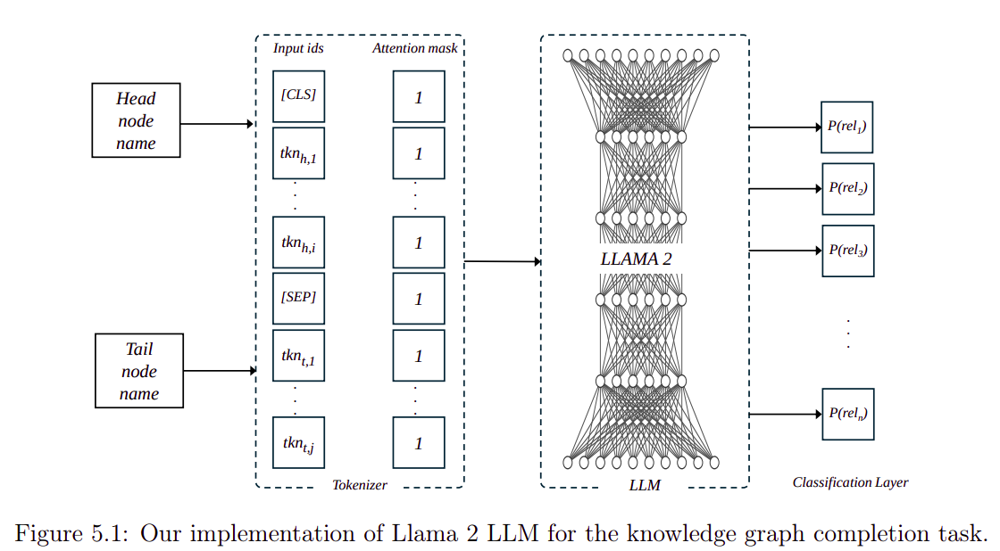

# Relations Prediction for Knowledge Graph Completion using Large Language Models

## Abstract
Knowledge Graphs have been widely used to represent facts in a structured format. Due to their large-scale applications, knowledge graphs suffer from being incomplete. The relation prediction task obtains knowledge graph completion by assigning one or more possible relations to each pair of nodes. In this work, we make use of the knowledge graph node names to fine-tune a large language model for the relation prediction task. By utilizing the node names only, we enable our model to operate sufficiently in the inductive settings. Our experiments show we accomplish new scores on a widely used knowledge graph benchmark.



## Software Requirements
- Python 3.8
- PtyTorch 2.1
- transformers 4.*
- tqdm 4

**Install Requirements**
```
python3 -m pip install torch==2.1
python3 -m pip install networkx==2.8
python3 -m pip install tqdm
python3 -m pip install transformers
```

## Hardware Requirements
 - GPU node > 80GB

## FreeBase Dataset

We evaluated our model on FB15K, which is a subset of FreeBase dataset. A copy of the dataset is provided in the `data` folder and the raw dataset can be downloaded using the link below.

[Download Raw Dataset](https://www.microsoft.com/en-us/download/details.aspx?id=52312)

## WordNet Dataset

We evaluated our model on WN18, that is 

## Run Training

The training script uses the same parameters reported in our paper.

```
./run.sh train chkpnt.pt data/FB15K n2v_embeddings.csv glove.6B.300d.txt > output.out &
```

## Run Evaluation

```
./run.sh train chkpnt.pt data/FB15K n2v_embeddings.csv glove.6B.300d.txt > output.out &
```
